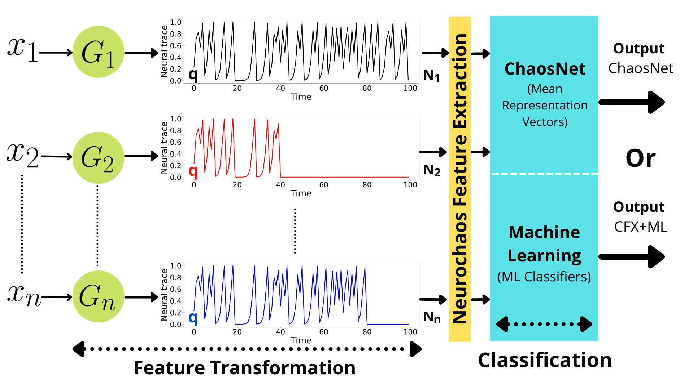

# Neurochaos Feature Transformation and Classification for Imbalanced Learning
Neurochaos Learning codes for classification in imbalanced learning.
All the datasets used in the experiments above can be found in the following drive link: https://drive.google.com/drive/folders/1XAKc88jzGhtopqZKSrIptpabFqoN2wvm?usp=sharing

The crux of the paper is provided in the following diagram.

[Video explanation on YouTube](https://www.youtube.com/watch?v=Og3SQiYcisQ) on the usage of neurochaos features and highlighting chief ideas and inspiration.

**Reference Paper:**

1. Balakrishnan, Harikrishnan Nellippallil, et al. "ChaosNet: A chaos based artificial neural network architecture for classification." Chaos: An Interdisciplinary Journal of Nonlinear Science 29.11 (2019): 113125.

2. Harikrishnan, N. B., and Nithin Nagaraj. "Neurochaos Inspired Hybrid Machine Learning Architecture for Classification." 2020 International Conference on Signal Processing and Communications (SPCOM). IEEE, 2020.

# Dependencies

 - `Python 3`
 - `Numpy`
 - `Numba`

# License

Copyright 2022 Deeksha Sethi, Nithin Nagaraj and Harikrishnan N. B.

   Licensed under the Apache License, Version 2.0 (the "License");
   you may not use this file except in compliance with the License.
   You may obtain a copy of the License at

       http://www.apache.org/licenses/LICENSE-2.0
       
       
    Unless required by applicable law or agreed to in writing, software
   distributed under the License is distributed on an "AS IS" BASIS,
   WITHOUT WARRANTIES OR CONDITIONS OF ANY KIND, either express or implied.
   See the License for the specific language governing permissions and
   limitations under the License.
